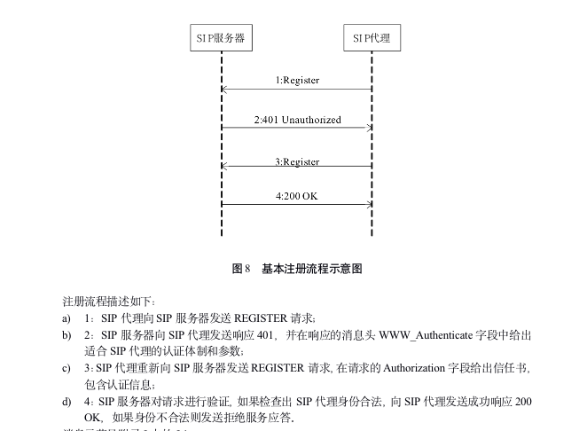
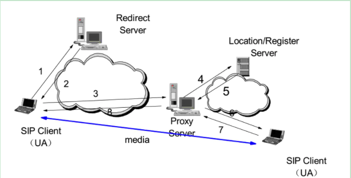
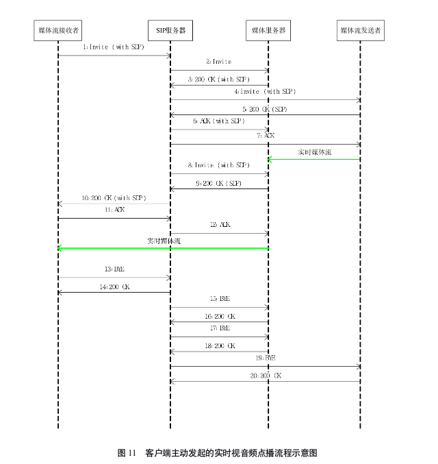
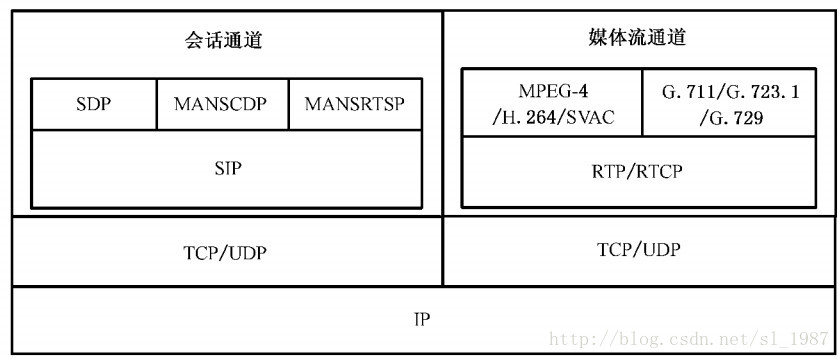
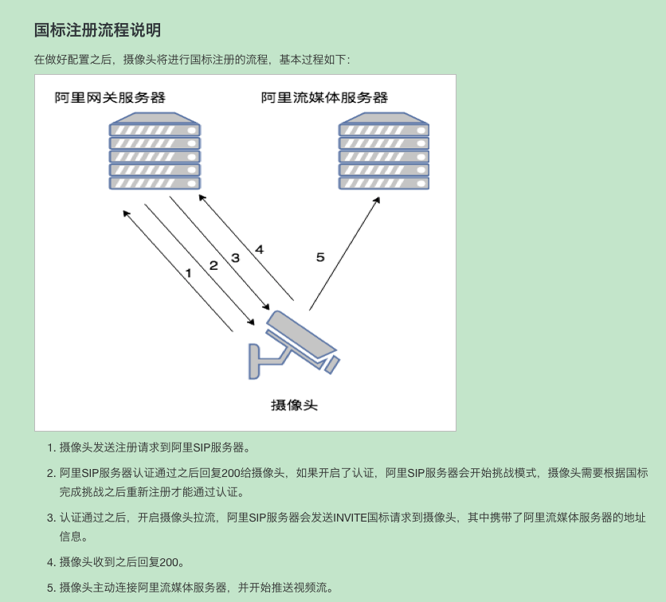

## GB28181解决的问题
- 不同平台互通(厂商都自定义取流协议)  
比如以前的摄像头都是零散的，每个公安局只能看到自己小范围的监控录像，发生了重大案件，还需要把硬盘监控资料交到上级部门，上级部门再组织大量人员人工回放查看，这样太影响效率了！

## 组成
### SIP信令
#### RFC 3261
- REGISTER
- INVITE
#### RFC 3428
- MESSAGE
- MANSCDP+xml
#### RFC 2976
- INFO
- MANSRTSP
#### RFC 3265
- SUBSCRIBE
- NOTIFY
#### RFC 4566
- SDP
### 流媒体
- RTP + PS/H264

## 基本功能
- 远程观看设备实时流
- 远程录像回放
- 设备控制(比如云台)
- 设备主动上报信息

## 注册流程

## 建立媒体流流程
### 基本流程

### 信令交互

## 封包

### REGISTER
- Request-Line: REGISTER sip:si服务器国标id@sip服务器ip：sip服务器端口 SIP/2.0
- Via: SIP/2.0/(TCP or UDP) sip设备ip：sip设备端口;rport;branch=xxx
- From: <sip:sip设备国标id@sip服务器域id>;tag=xxx
- To: <sip:sip设备国标id@sip服务器域id>
- Call-Id: xxx
- CSeq: xxx REGISTER
- Contact: <sip:sip设备国标id@sip设备ip：sip设备端口>
- Max-Forwards: xxx
- User-Agent: xxx
- Expiers: xxx
- Content-Length: 0

## 基本概念
- uac
- uas  
    逻辑概念，代表sip信令的发起方和服务方,可能是两个独立的实体，也可能在一个主机上
- Redirect Server  
    重定向服务器，用于查找sip代理服务器
- Registrar  
   位置服务器，记录设备的ip和设备id的对应关系

## 我们要做的

- 和实际gb28181的区别：c/s p2p
- sip信令服务器
    - register
    - invite
    - message
        - catalog
        - keepalive
        - alarm
        - 云台控制
    - subscribe
        - 订阅camera经纬度
- 流媒体服务
    - RTP+PS解析，转换http-flv、rtmp、hls
- NVR or 国标级联

## 开源软件
- eXosip & osip
- pjsip
- freeswitch
- srs
- opal

## 抓包
- [GB28181抓包](./data/gb28181.pcap)

## 文档
- [国标协议](https://raw.githubusercontent.com/felix-001/GB28181/master/doc/GB-T28181%20%E8%A7%86%E9%A2%91%E8%81%94%E7%BD%91_%E4%BF%A1%E6%81%AF%E4%BC%A0%E8%BE%93%E4%BA%A4%E6%8D%A2%E6%8E%A7%E5%88%B6%E6%8A%80%E6%9C%AF%E8%A6%81%E6%B1%82%EF%BC%88%E6%8A%A5%E6%89%B9%E7%A8%BF%EF%BC%893.17.doc)
- [PS流解析](https://blog.csdn.net/weixin_43608153/article/details/90707272?utm_medium=distribute.pc_relevant.none-task-blog-baidujs-1)
